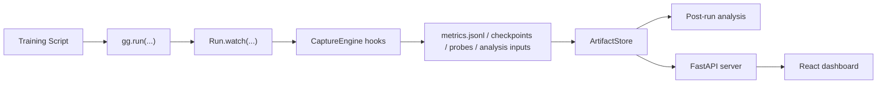

# Architecture

## Mental model

GradGlass has four major layers:

1. Run orchestration
2. Artifact storage and capture
3. Analysis and derived views
4. Serving and dashboard presentation

## Package map

### Core orchestration

- `gradglass/core.py`
  Owns the top-level `GradGlass` controller and shared artifact store.
- `gradglass/run.py`
  Defines run lifecycle, logging, monitoring, finishing states, leakage helpers, and explainability logging.
- `gradglass/cli.py`
  Exposes `serve`, `list`, `open`, `monitor`, `stop`, and `analyze`.

### Artifact capture and persistence

- `gradglass/artifacts.py`
  Defines the workspace root strategy and the `ArtifactStore` read/write layer.
- `gradglass/capture.py`
  Attaches framework hooks, extracts architecture, buffers activations and gradients, and writes probe bundles.
- `gradglass/browser.py`
  Encapsulates detached browser launching and URL reload behavior.

### Analysis and diagnosis

- `gradglass/analysis/registry.py`
  Custom-test registry, enums, and result models.
- `gradglass/analysis/builtins.py`
  Built-in checks used by post-run analysis and alerts.
- `gradglass/analysis/runner.py`
  Builds a `TestContext`, executes tests, and renders text summaries.
- `gradglass/analysis/report.py`
  Materializes persisted analysis reports.
- `gradglass/analysis/leakage.py`
  Legacy leakage-report compatibility plus array-based convenience wrappers.
- `gradglass/analysis/data_monitor/*`
  The new dataset-monitoring subsystem: adapters, inspectors, fingerprinting, analyzers, models, and builder logic.

### Derived summaries and dashboards

- `gradglass/diff.py`
  Checkpoint diffs, prediction diffs, gradient-flow helpers, architecture diffs.
- `gradglass/evaluation.py`
  Infers task type and builds evaluation payloads from metrics and predictions.
- `gradglass/alerts.py`
  Merges runtime state, analysis results, and live heuristics into alert cards.
- `gradglass/visualizations.py`
  Builds weights, activations, saliency, and embeddings payloads from artifacts.
- `gradglass/telemetry.py`
  Collects infrastructure and runtime-health information.
- `gradglass/server.py`
  Exposes the REST API, websocket stream, and static dashboard app.

### Frontend

- `gradglass/dashboard/`
  React + Vite frontend with pages for overview, training, evaluation, interpretability, data, comparison, and infrastructure.

## Run flow

## Design choices worth knowing

- Artifact-first architecture. The dashboard is a view layer over files, not the source of truth.
- Rehydratable runs. `Run.from_existing(...)` rebuilds a run object from artifacts for read-heavy workflows.
- Local server model. Serving is intentionally simple and geared toward workstation use.
- Backward compatibility. Leakage reporting keeps a legacy-shaped payload even though the new engine is dataset-monitor based.
- Incremental richness. Basic metric logging works alone; advanced views appear as richer artifacts are captured.
